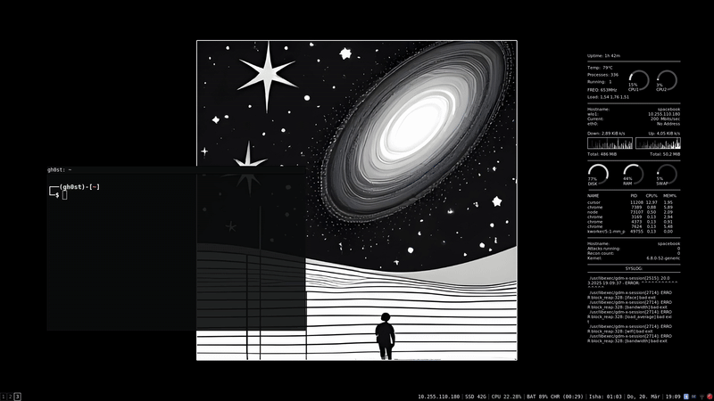

# ff

**ff** is a TUI-based directory navigation tool that dramatically improves your command-line workflow by providing smart, fast directory navigation with a prioritized view of your most frequently visited directories.



## Core Concept

The traditional `cd` workflow requires typing out paths, using tab completion, or remembering complex directory structures. **ff** replaces this with a visual, history-aware interface that:

1. Shows you directories in order of frequency/recency
2. Provides instant search capabilities
3. Allows custom command binding to directories
4. Works seamlessly with your existing shell

## Quick Start

```bash
$ ff
```

That's it! A TUI interface will appear showing your most frequently visited directories.

### Basic Workflow

1. **Navigate**: Use up/down arrows or j/k to select a directory
2. **Enter**: Press Enter to move into the selected directory
3. **Back**: Press Backspace to go up one level
4. **Search**: Press Space, then type to filter directories in real-time
5. **Execute**: Press q to quit and cd into the current directory

### Key Enhancements

- **Search Mode**: Press Space, then type to instantly filter directories
- **Command Binding**: Press Ctrl+b to associate a command with the current directory
- **File Mode**: Press f to toggle between viewing directories and files
- **Help**: Press h to see all keyboard shortcuts

## Detailed Features

### Smart Directory Ranking

ff uses a sophisticated algorithm to rank directories based on:

- **Access Frequency**: Directories you visit often appear higher in the list
- **Recency**: Recently visited directories get priority
- **Parent/Child Relationships**: Parent directories of frequently visited locations get boosted

This means your most important directories are always just a few keystrokes away, regardless of how deep they are in your filesystem.

### Real-Time Search

Press Space to enter search mode and begin typing to filter directories instantly. This eliminates the need to navigate through complex directory structures:

1. Press Space to enter search mode
2. Type part of the directory name
3. Select from filtered results
4. Press Enter to navigate to the selected directory

### Command Binding

Associate custom commands with specific directories to execute automatically when you navigate to them:

1. Navigate to a directory
2. Press Ctrl+b to enter bind mode
3. Type a command (e.g., `source venv/bin/activate` or `git status`)
4. Press Enter to save

Next time you navigate to this directory using ff, the bound command will execute automatically!

### File/Directory Toggle

By default, ff shows only directories for navigation. Toggle file view:

1. Press f to switch between directory-only and file view
2. In file view, files are shown alongside directories, sorted by recency

This is particularly useful for quickly accessing recently modified files.

## Keyboard Controls

| Key       | Function                                    |
| --------- | ------------------------------------------- |
| ↑ or k    | Move selection up                           |
| ↓ or j    | Move selection down                         |
| Enter     | Navigate into selected directory            |
| Backspace | Navigate to parent directory                |
| Space     | Enter/exit search mode                      |
| Ctrl+b    | Enter/exit command binding mode             |
| f         | Toggle files/directories view               |
| h         | Toggle help screen                          |
| q         | Quit and cd into current directory          |
| Esc       | Exit help / Quit without changing directory |

## Advanced Usage

### Configuration

ff stores its configuration in two files:

- **~/.ff_config**: Tracks directory access history and rankings
- **~/.ff_scripts**: Stores commands bound to specific directories

## Installation

### Quick Installation

```bash
curl -s https://raw.githubusercontent.com/infosec-vault/ff/refs/heads/main/ff.sh | sh
```

### Build From Source

If you want to build ff from source, you must have cargo installed.

```bash
git clone https://github.com/infosec-vault/ff
cd ff
chmod +x install.sh
./install.sh
```

## How It Works

ff maintains a history of your directory navigation and assigns each directory a score based on:

1. **Number of visits**: Each time you navigate to a directory, its score increases
2. **Recency**: More recent visits have a higher impact on the score
3. **Contextual importance**: Parent directories of important locations get boosted scores

This scoring system allows ff to present a highly personalized view of your filesystem, prioritizing the directories that matter most to your workflow.

## License

This project is licensed under the MIT License - see the LICENSE file for details.

```

```
